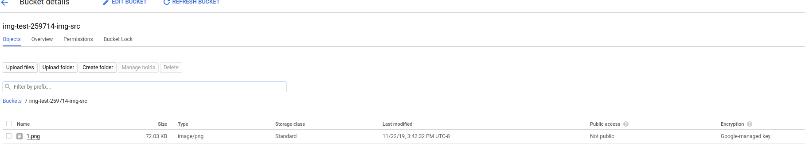

# Yet another image file converter on GCP

Two workflows to convert an images to different formats on GCP and optionally save on [Cloud CDN](https://cloud.google.com/cdn/).

This repo converts images but the pattern described in the `Batch` confiuration can be reused as a [fan-out pattern](https://en.wikipedia.org/wiki/Fan-out_(software)) using google cloud serverless components.  What that means is, one event fans out and gets processed independently and asynchronously by different Cloud Run instances


1. Inline

- Inline:  upload directly, convert file; either return converted file in respose or save to GCS and provide CDN URL 

`client -> `
    `[upload image in POST, specify conversion specs as query-param] --> `
       `Cloud Run converts image --> ` 
          `Saves converted file to GCS`


2. Batch

- Upload images files to source GCS Bucket.  Specify file formats to convert to as metadata.  Converted files saved to GCS

`client --> `
   `GCS --> `
      `[Object Change Notification] --> `
         `GCF --> `
           `[for each file format, create Cloud Task] --> `
              `Cloud Task --> Cloud Run converts image --> `
                 `Saves converted file to GCS.`


both mode uses - [https://github.com/gographics/imagick](https://github.com/gographics/imagick) to convert the iamages


This repo also shows

* how to track the request using [Cloud Trace](https://cloud.google.com/trace/)
* how to emit custom metrics describing the filesize and bytes procssed via [OpenCensus->Stackdriver](https://github.com/salrashid123/salrashid123.github.io/tree/master/cloud_trace)


### Setup Env Variables

```
export PROJECT_ID=`gcloud config get-value core/project`
export PROJECT_NUMBER="$(gcloud projects describe $PROJECT_ID --format='get(projectNumber)')"
export DEST_BUCKET_NAME=$PROJECT_ID-cdn
export CDN_URL=https://images.esodemoapp2.com
export DEST_BUCKET_NAME=$PROJECT_ID-cdn
export SRC_BUCKET_NAME=$PROJECT_ID-img-src

gcloud services enable compute.googleapis.com run.googleapis.com \
   cloudfunctions.googleapis.com \
   cloudtrace.googleapis.com logging.googleapis.com \
   monitoring.googleapis.com  cloudtasks.googleapis.com
```

### CDN

Create GCS bucket that is enabled for Cloud CDN.  You don't have to do this step if you don't intend to place the processed image where its available publicly via cloud cdn.

ref [Using a Cloud Storage bucket as a load balancer backend](https://cloud.google.com/load-balancing/docs/backend-bucket)


You can use the canned ssl certificates in this repo.

```bash
cd certs/
gsutil mb gs://$DEST_BUCKET_NAME

gcloud compute addresses create image-cdn --global

gcloud compute ssl-certificates create cdn-cert --certificate=images.crt --private-key=images.key

gcloud compute backend-buckets create static-bucket --gcs-bucket-name $DEST_BUCKET_NAME --enable-cdn

gcloud compute url-maps create cdn-map  --default-backend-bucket=static-bucket


gcloud compute target-https-proxies create cdn-lb-proxy --url-map=cdn-map --ssl-certificates=cdn-cert --global
gcloud compute forwarding-rules create cdn-content-rule --address  35.244.244.107 --global --target-https-proxy cdn-lb-proxy --ports 443
```


List the IP address (you'll use is if you want to serve the images from CDN)

```bash
$  gcloud compute addresses list
NAME                              ADDRESS/RANGE    TYPE      PURPOSE       NETWORK  REGION       SUBNET   STATUS
image-cdn                         35.244.244.107   EXTERNAL                                               RESERVED
```


## Inline

Configure Inline processing pipeline


First note the
* Cloud Run Service Account Format: `$PROJECT_NUMBER-compute@developer.gserviceaccount.com`

Allow that service account to write Metrics, Logs and Trace
```
gcloud projects add-iam-policy-binding $PROJECT_ID  \
   --member=serviceAccount:$PROJECT_NUMBER-compute@developer.gserviceaccount.com \
   --role=roles/logging.logWriter

gcloud projects add-iam-policy-binding $PROJECT_ID  \
   --member=serviceAccount:$PROJECT_NUMBER-compute@developer.gserviceaccount.com \
   --role=roles/monitoring.metricWriter

gcloud projects add-iam-policy-binding $PROJECT_ID  \
   --member=serviceAccount:$PROJECT_NUMBER-compute@developer.gserviceaccount.com \
   --role=roles/cloudtrace.agent
```

Grant the Service account Cloud Run uses permissions to write to the destination bucket

```
gsutil iam ch serviceAccount:$PROJECT_NUMBER-compute@developer.gserviceaccount.com:objectCreator,objectViewer,objectAdmin gs://$DEST_BUCKET_NAME
```


Build the Docker image
```
cd convert_stream/run
docker build -t gcr.io/$PROJECT_ID/imagetx .
```

If you want to run the image locally, create a service account and grant the same IAM permissions as given to cloud Run (save the json file as `svc_account.json`)

```
docker run -v /path/to/service_account_file/:/certs \
  -e PROJECT_ID=$PROJECT_ID -e CDN_URL=$CDN_URL \
  -e DEST_BUCKET_NAME=$DEST_BUCKET_NAME \
  -e GOOGLE_APPLICATION_CREDENTIALS=/certs/svc_account.json \
  -p 8080:8080 gcr.io/$PROJECT_ID/imagetx
```

Upload the file to gcr:

```
gcloud auth configure-docker
docker push gcr.io/$PROJECT_ID/imagetx
```

Deploy toCloud Run
```
gcloud config set run/platform managed
gcloud config set run/region us-central1

gcloud beta run deploy imagex --image=gcr.io/$PROJECT_ID/imagetx \
  --set-env-vars=PROJECT_ID=$PROJECT_ID,DEST_BUCKET_NAME=$DEST_BUCKET_NAME,CDN_URL=$CDN_URL \
  --allow-unauthenticated
```

Note the Cloud RUN URL


Use any image file locally and POST to cloud run as form encoded:

In the following case `logo.png` will get converted to jpg and saved as `logo2.jpg`

```
 curl -s -X POST -F 'name=logo2' -F 'format=jpg' -F 'image=@logo.png' https://imagex-6w42z6vi3q-uc.a.run.app/convert
```

The default application under `convert_stream/src/main.go` simply returns a URL for the CDN.  If you actually want the image returned inline, do not specify the `CDN_URL` environment variable during deployment.  The default applciation does not mark the uploaded image as public though i have code there commentd out that does that.


## BATCH


`GCS --> GCF --> Tasks --> Run --> GCS`


Note the Service Account formats used here:

* Cloud Run SA: `$PROJECT_NUMBER-compute@developer.gserviceaccount.com`
* Cloud Functions SA: `$PROJECT_ID@appspot.gserviceaccount.com`
* Tasks SA: `service-$PROJECT_NUMBER@gcp-sa-cloudtasks.iam.gserviceaccount.com`


Create the _Source_ GCS Bucket.  This bucket will hold the images you upload that you intend to convert.

```
gsutil mb gs://$SRC_BUCKET_NAME
```

Build and Deploy Cloud Run

```
cd convert_batch/run

docker build -t gcr.io/$PROJECT_ID/imagebatch .
docker push gcr.io/$PROJECT_ID/imagebatch


gcloud beta run deploy imagebatch --image=gcr.io/$PROJECT_ID/imagebatch --no-allow-unauthenticated \
  --set-env-vars=PROJECT_ID=$PROJECT_ID,SRC_BUCKET_NAME=$SRC_BUCKET_NAME,DEST_BUCKET_NAME=$DEST_BUCKET_NAME,CDN_URL=$CDN_URL
```

Note down the Cloud RUN URL and export it (eg)
```
export RUN_URL=https://imagebatch-6w42z6vi3q-uc.a.run.app
```

Allow Run to read Source GCS Bucket
```
  gsutil iam ch serviceAccount:$PROJECT_NUMBER-compute@developer.gserviceaccount.com:objectViewer gs://$SRC_BUCKET_NAME
```

Allow Run to write to DEST GCS Bucket
```
  gsutil iam ch serviceAccount:$PROJECT_NUMBER-compute@developer.gserviceaccount.com:objectCreator gs://$DEST_BUCKET_NAME
```

Deploy TaskQueue:
```
gcloud tasks queues create q1
```


Allow GCF to enqueue Task
```
gcloud projects add-iam-policy-binding $PROJECT_ID \
  --member serviceAccount:$PROJECT_ID@appspot.gserviceaccount.com \
  --role roles/cloudtasks.enqueuer
```

Allow Tasks use OIDC TOken AS GCF

```
gcloud iam service-accounts  add-iam-policy-binding \
   $PROJECT_ID@appspot.gserviceaccount.com \
   --member=serviceAccount:service-$PROJECT_NUMBER@gcp-sa-cloudtasks.iam.gserviceaccount.com  --role=roles/cloudtasks.serviceAgent
```


Deploy GCF function invoked by GCS

```
cd convert_batch/gcf/

gcloud  functions deploy Fan --entry-point=Fan --runtime go111 \
  --trigger-resource=${SRC_BUCKET_NAME} --set-env-vars=RUN_URL=${RUN_URL},SERVICE_ACCOUNT=$PROJECT_ID@appspot.gserviceaccount.com \
  --trigger-event=google.storage.object.finalize --project=${PROJECT_ID}
```


- Allow GCF OIDC Token to invoke Run

```
  gcloud run services add-iam-policy-binding imagebatch \
    --member="serviceAccount:$PROJECT_ID@appspot.gserviceaccount.com" \
    --role="roles/run.invoker"
```

Upload file to convert to the Destination BUcket

```
 gsutil -h "x-goog-meta-name:1" -h "x-goog-meta-formats:svg,jpg" cp logo.png gs://$SRC_BUCKET_NAME/
```

What you should see in the source bucket is the list uploaded file



For each file format specified (`svg`,`png`) a new converted file will appear


### Monitoring Metrics

Cloud Run was configured to emit custom metrics and traces.   The specific metric that is captures is the size of the image file that was processed and the file type.  You can see the metric in Stackdriver as  

```json
    {
      "name": "projects/img-test-259714/metricDescriptors/custom.googleapis.com/opencensus/mBytes/bytes",
      "labels": [
        {
          "key": "filetype"
        }
      ],
      "metricKind": "CUMULATIVE",
      "valueType": "DISTRIBUTION",
      "unit": "By",
      "description": "The number of bytes processed",
      "displayName": "OpenCensus/mBytes/bytes",
      "type": "custom.googleapis.com/opencensus/mBytes/bytes",
      "monitoredResourceTypes": [
        "aws_ec2_instance",
        "cloud_composer_environment",
        "cloud_composer_workflow",
        "dataflow_job",
        "gce_instance",
        "generic_node",
        "generic_task",
        "gke_container",
        "global",
        "k8s_cluster",
        "k8s_container",
        "k8s_node",
        "k8s_pod",
        "knative_revision"
      ]
    },
```

and in stackdriver console as heatmap


### Tracing

Cloud Run is also enabled for cloud Trace measurements.  You can find those traces on the GCP console and shows the request spans you define _and_ the api calls to GCP


https://cloud.google.com/trace/docs/reference/#generating_trace_id_and_span_id

The trace shown in this repo only shows the portion that is handled within the Cloud Run Invcation.  If you would like to see the part invoked all the way from Cloud Functions-->Task-->Cloud Run, you need to propagate a trace context through.  That is, you need to generate a cloud trace ID within cloud functions, then embed that as the `X-Cloud-Trace-Context` header value into cloud task ...which will eventually make it to cloud run. 

If you would like to see that portion, please file a FR here and i'll get to that bit.


## Conclusion

i don't have any, really... its just a sample but hopefully you can use either pattern for other usecases.


#### TODO:

* make dockerfile smaller...
* process the image as a stream.

# REFERENCES

just some references

- [Google Cloud Storage “exploder” #2](https://medium.com/google-cloud/google-cloud-storage-exploder-2-9870d41fcee3)
- [GPG stream encryption and decryption on Google Cloud Functions and Cloud Run](https://medium.com/google-cloud/gpg-stream-encryption-and-decryption-on-google-cloud-functions-and-cloud-run-8cb732404134)
- [Anti Virus file scanning on Google Cloud Storage using ClamAV](https://medium.com/google-cloud/tutorial-on-how-to-use-clamav-to-scan-files-uploaded-to-google-cloud-storage-gcs-b37777360210)
- [https://github.com/GoogleCloudPlatform/golang-samples/blob/master/functions/imagemagick/imagemagick.go](https://github.com/GoogleCloudPlatform/golang-samples/blob/master/functions/imagemagick/imagemagick.go)
- [https://medium.com/@didil/image-resizing-with-go-and-cloud-functions-792a47e6473d](https://medium.com/@didil/image-resizing-with-go-and-cloud-functions-792a47e6473d)
- [https://medium.com/learning-the-go-programming-language/streaming-io-in-go-d93507931185](https://medium.com/learning-the-go-programming-language/streaming-io-in-go-d93507931185)
